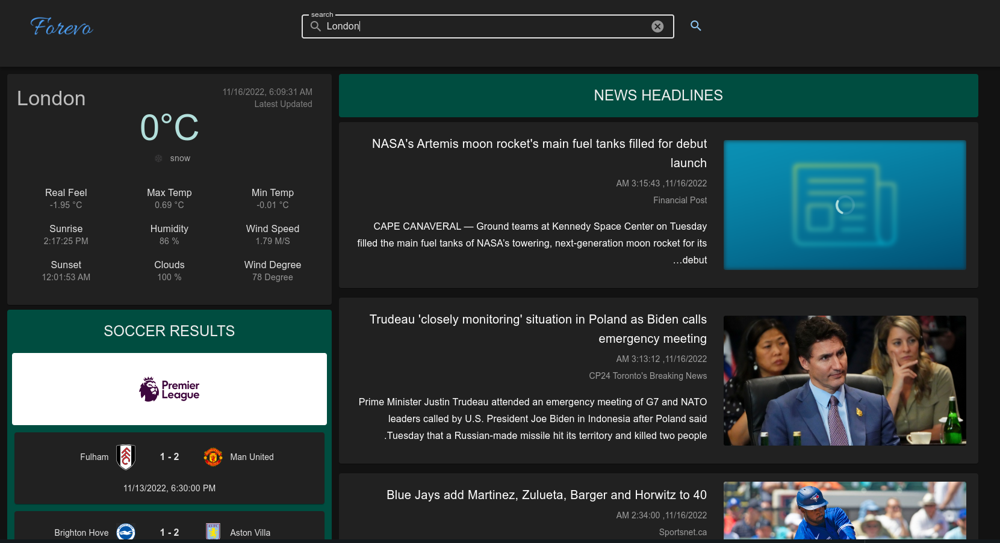

<br/>
<p align="center">
  <a href="https://github.com/ghanim01/forevoapp">
    
  </a>

  <h3 align="center">A simple vuejs single page app to get news, weather and soccer results
</h3>
</p>

## Demo

- [Live Demo](https://forevoapp.vercel.app/)

<br />

## Screenshot



<br />

## Tech Stack

- [Vue.js 3](https://www.football-data.org/)
- [Vuetify 3.0](https://next.vuetifyjs.com/en/)
- [Vite](https://vitejs.dev/)
- [Pinia](https://pinia.vuejs.org/)
- [Vue Router](https://router.vuejs.org/)

## API's Used

- [Football-data.org](https://vuejs.org/)
- [News API](https://newsapi.org/)
- [OpenWeather](https://openweathermap.org/)
- [Cities.JSON](https://github.com/lutangar/cities.json)

## Installation and Build

#### - Clone the repo

```sh
    git clone https://github.com/ghanim01/forevoapp.git
```

#### - Install NPM packages

```sh
    npm install
```

#### - Run project for development

```sh
    npm run dev
```

#### - Build the project

```sh
    npm run build
```

## Authors

- [Ahmed Ghanem](https://github.com/ghanim01/)

## License

[](https://choosealicense.com/licenses/mit/)
